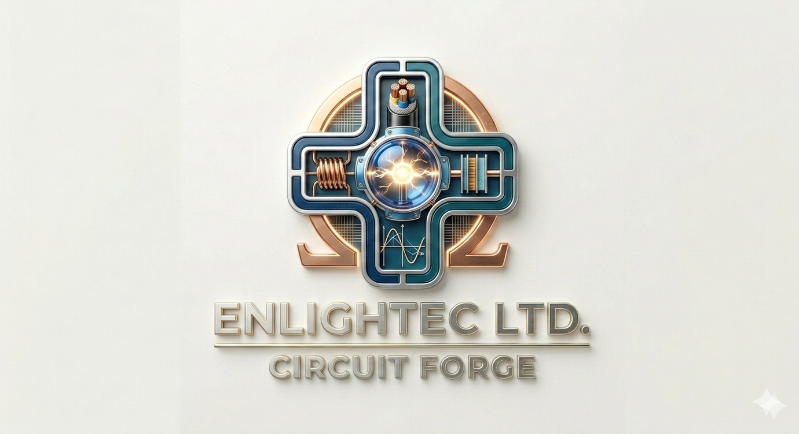

<p align="center">
  
</p>

# CircuitForge

> Open-source EDA suite — schematic capture, SPICE-style circuit simulation,
> and PCB layout in a single Python application. Multi-tier: PyQt GUI for
> engineers, Flask REST API for clients and automation, Flask web portal for
> browsers, Docker / systemd / Kubernetes deployment paths.

<p align="left">
  <a href="https://www.enlightec.com">
    
  </a>
</p>

Developed by **Robert Andrew Stillwell** at [Enlightec Ltd.](https://www.enlightec.com) — *Creativity in Productivity*.

<br clear="left">

---

## Table of Contents

- [Features](#features)
- [Architecture](#architecture)
- [Project Structure](#project-structure)
- [Installation](#installation)
  - [Running as system services](#running-as-system-services)
  - [Automatic updates](#automatic-updates)
- [Docker Hub Images](#docker-hub-images)
- [Quick Start](#quick-start)
- [REST API](#rest-api)
- [Remote Access via ngrok](#remote-access-via-ngrok)
- [Default Credentials](#default-credentials)
- [License](#license)

---

## Features

### Simulation Engine
- Modified Nodal Analysis (MNA) solver, complex-aware for AC
- DC operating point + parametric DC sweep
- AC small-signal analysis (log/linear sweep, magnitude/phase)
- Transient analysis (backward Euler + trapezoidal companion models)
- Newton-Raphson iteration for nonlinear devices (diode, BJT, MOSFET Level 1)
- SPICE2/3 netlist parser (including SIN / PULSE / PWL / EXP sources)

### Schematic Capture
- Drag-and-drop component placement on a 0.1″ snap grid
- Orthogonal wire routing (L- and Z-shape)
- Symbol library with parametric primitives (R/L/C/D/V/GND/op-amp)
- SVG export

### PCB Layout
- Multi-layer board (up to 32 copper layers via `LayerStack`)
- Pads, traces, vias, copper-pour zones
- Footprint library: SMD (0402, 0603, 0805, 1206, SOT-23), through-hole (TO-92, TO-220, DIP-4…40), SOIC, LQFP
- DRC: clearance, trace width, drill, annular ring, courtyard
- Grid-based autorouter (Lee's algorithm)
- Ratsnest generation from the netlist

### Component Library
108-entry default DB including passives, semiconductors, op-amps (LM741, LM358, TL072, OPA2134), 7400-series TTL, 4000-series CMOS, voltage regulators, microcontrollers (ATmega328P, RP2040, STM32F4, ESP32), sensors, connectors. Extensible via `circuitforge/libs/*.json`.

### File Formats
- **KiCAD v6** — `.kicad_sch`, `.kicad_pcb`, `.kicad_sym`, `.kicad_mod` (read + write)
- **Eagle** — `.sch`, `.brd` (read, partial)
- **Altium** — ASCII export (read, partial)
- **Gerber RS-274X** — full-set export (14 layers)
- **Excellon NC drill** — `.drl` export
- **SPICE** — `.cir`, `.sp`, `.net` (read + write)
- **SVG** — schematic + PCB export
- **BOM** — CSV + HTML
- **IPC-D-356A** — bare-board test netlist export

### Multi-tier Deployment
- **PyQt5/PySide6 desktop GUI** for engineers
- **Flask REST API** (`run_cloud.py`) — JWT auth, CORS, gunicorn-ready
- **Flask web portal** (`run_web.py`) — browser-based simulator
- **Docker** + **docker-compose** (build + Docker Hub variants)
- **systemd** services with sandboxing (`NoNewPrivileges`, `ProtectSystem=strict`, capability drop, syscall filter)
- **Kubernetes** manifests with non-root, read-only-fs, `seccompProfile=RuntimeDefault`
- **ngrok integration** with QR-code client onboarding

---

## Architecture

```
┌──────────────┐  ┌──────────────┐  ┌──────────────┐
│  Engineer    │  │   Browser    │  │   Headless   │
│  PyQt GUI    │  │  (web/)      │  │   Scripts    │
└──────┬───────┘  └──────┬───────┘  └──────┬───────┘
       │                 │                 │
       │                 ▼                 │
       │     ┌──────────────────────┐      │
       └────►│   Flask REST API     │◄─────┘
             │   /api/v1/*          │
             │   JWT + CORS         │
             │   (run_cloud.py)     │
             └──────────┬───────────┘
                        ▼
          ┌──────────────────────────────┐
          │   CircuitForge Core          │
          │   ├ MNA simulator            │
          │   ├ Schematic canvas         │
          │   ├ PCB board model          │
          │   ├ Format I/O (KiCAD/Gerber)│
          │   └ Component library        │
          └──────────────────────────────┘
```

---

## Project Structure

```
circuitforge/
├── circuitforge/
│   ├── core/          # Component, Netlist, Project, Units
│   ├── components/    # R/L/C, sources, semis, op-amps, digital, ICs, library
│   ├── simulation/    # MNA, DC/AC/Transient, SPICE parser
│   ├── schematic/     # Canvas, symbols, wires, editor widget
│   ├── pcb/           # Layers, footprints, traces, vias, zones, DRC, autorouter
│   ├── io/            # KiCAD, Eagle, Altium, Gerber, Excellon, SVG, BOM, IPC
│   ├── gui/           # PyQt main window, panels, scope
│   ├── server/        # REST API (api.py, auth.py, qr.py)
│   ├── web/           # Flask portal (templates/, static/)
│   ├── libs/          # 108-entry default component DB
│   └── cli.py         # `python -m circuitforge.cli …`
├── run_qt.py / main.py        # GUI launcher
├── run_cloud.py               # REST API launcher (gunicorn-aware)
├── run_web.py                 # Web portal launcher
├── install.sh                 # Cross-platform installer
├── uninstall.sh               # Reverses install.sh
├── update.sh                  # GitHub poller + auto-update scheduler
├── install-services.sh        # systemd installer (system / --user)
├── start_desktop.sh           # GUI quick-launch
├── start_cloud.sh             # API quick-launch
├── start_web.sh               # Web portal quick-launch
├── start_ngrok.sh             # ngrok tunnel + QR onboarding
├── start_docker_hub.sh        # Pull published image
├── Dockerfile                 # Multi-stage runtime image
├── docker-compose.yml         # Build locally
├── docker-compose.hub.yml     # Use Docker Hub image + optional ngrok profile
├── docker/api-entrypoint.sh   # Container dispatch
├── systemd/                   # circuitforge-{api,web}.service unit files
├── k8s/deployment.yaml        # Namespace, deployments, services, ingress
├── examples/                  # SPICE decks + Python build-pcb example
└── tests/                     # 17 tests (engine + REST API)
```

---

## Installation

```bash
git clone https://github.com/stillwell/circuitforge.git
cd circuitforge
./install.sh                    # creates .venv, installs deps, seeds admin user
./install.sh --ngrok-login      # also configures ngrok for remote access
./install.sh --systemd          # also installs systemd --user services
./install.sh --no-gui           # skip PyQt
```

### Running as system services

```bash
sudo ./install-services.sh                # /opt/circuitforge + dedicated user
# or
./install-services.sh --user              # ~/.config/systemd/user
```

The unit files run as a dedicated `circuitforge` (UID 1000, `/usr/sbin/nologin`)
user under sandboxing:
`NoNewPrivileges`, `ProtectSystem=strict`, `ProtectHome=true`,
`CapabilityBoundingSet=`, `MemoryDenyWriteExecute`,
`SystemCallFilter=@system-service ~@privileged @resources`.

### Automatic updates

```bash
./update.sh                             # poll GitHub once, interactive
./update.sh --auto                      # for cron / systemd timer
./update.sh --install-schedule=daily    # set up unattended updates
./update.sh --show-schedule
./update.sh --uninstall-schedule
```

Concurrency-locked via `.update.lock.d/`. Dirty-tree refusal in `--auto`.
Database-style files (`data/users.json`) are backed up to `data/.backup/`
before each pull.

---

## Docker Hub Images

```bash
# Local build:
docker compose up

# Published image:
export CIRCUITFORGE_JWT_SECRET=$(openssl rand -hex 32)
export CIRCUITFORGE_SESSION_SECRET=$(openssl rand -hex 32)
./start_docker_hub.sh

# With ngrok tunnel (after `./install.sh --ngrok-login`):
./start_docker_hub.sh ngrok
```

---

## Quick Start

```bash
# Activate the venv
source .venv/bin/activate

# Simulate a SPICE deck
python -m circuitforge.cli simulate examples/divider.cir

# Transient sweep
python -m circuitforge.cli simulate examples/rc_lowpass.cir \
    --transient 0 5m 10u --probe out

# Build a PCB programmatically
python examples/build_pcb.py

# Launch the GUI
./start_desktop.sh

# Launch the REST API
./start_cloud.sh                    # http://localhost:8080

# Launch the browser portal
./start_web.sh                      # http://localhost:5000
```

---

## REST API

All endpoints are under `/api/v1/`. Tokens are HMAC-SHA256 JWTs.

```
GET    /api/v1/health
GET    /api/v1/server-config        # for mobile/desktop client onboarding

POST   /api/v1/auth/login           {username, password}    → tokens
POST   /api/v1/auth/refresh         {refresh_token}
POST   /api/v1/auth/register        admin-only

GET    /api/v1/library              ?q=…&kind=…
GET    /api/v1/library/<name>

POST   /api/v1/simulate/op          body: SPICE deck (text or JSON)
POST   /api/v1/simulate/dc          {deck, source, start, stop, step}
POST   /api/v1/simulate/ac          {deck, fstart, fstop, ppd}
POST   /api/v1/simulate/tran        {deck, tstop, dt, tstart?}

POST   /api/v1/pcb/gerber           body: .kicad_pcb text   → zip
POST   /api/v1/pcb/drill            body: .kicad_pcb text   → .drl
POST   /api/v1/pcb/drc              body: .kicad_pcb text   → violations

GET    /api/v1/qr                   ngrok QR PNG
```

Example:

```bash
TOK=$(curl -s -X POST http://localhost:8080/api/v1/auth/login \
  -H 'Content-Type: application/json' \
  -d '{"username":"admin","password":"admin"}' \
  | jq -r .access_token)

curl -X POST http://localhost:8080/api/v1/simulate/op \
  -H "Authorization: Bearer $TOK" \
  -H 'Content-Type: text/plain' \
  --data-binary $'Divider\nV1 vin 0 5\nR1 vin mid 10k\nR2 mid 0 10k\n.end'
```

---

## Remote Access via ngrok

```bash
./install.sh --ngrok-login          # opens dashboard, prompts (hidden) for token
./start_cloud.sh &                  # bring the API up
./start_ngrok.sh                    # tunnel + auto-generate QR PNG
```

`start_ngrok.sh` polls the local ngrok inspector at
`http://127.0.0.1:4040/api/tunnels` and writes:

- `data/ngrok_public_url.txt`        bare URL
- `data/ngrok_client_config.json`    JSON for mobile/desktop clients
- `data/ngrok_qr.png`                QR (via `qrcode` Python pkg or system `qrencode`)

Clients can scan the QR or paste the URL into a *Server URL* field to point
at your tunnel. The exact same convention is used by the
[MedPharm ERP](https://www.github.com/stillwell/medpharm/) project, and the
`ngrok.env` file is shared between the two at
`~/.config/medpharm/ngrok.env`.

---

## Default Credentials

On first run the API creates an `admin` user with password `admin`.
Change it immediately:

```bash
curl -X POST http://localhost:8080/api/v1/auth/register \
  -H "Authorization: Bearer $TOK" \
  -H 'Content-Type: application/json' \
  -d '{"username":"admin","password":"<new>","role":"admin"}'
```

The user store is `data/users.json` (PBKDF2-HMAC-SHA256, 200k iterations,
per-user 16-byte salt). Override the JWT secret via
`CIRCUITFORGE_JWT_SECRET` and the session secret via
`CIRCUITFORGE_SESSION_SECRET`.

---

## License

CircuitForge is **GNU GPL v3 or later**. See the [`LICENSE`](LICENSE) file
for the full text. In short:

- You may use, study, modify, and redistribute this software.
- Derivative works must also be released under the GPL v3 (or later), with
  source available to anyone who receives the binary.
- The program is provided **WITHOUT ANY WARRANTY** — see
  `circuitforge --show-w`.
- Redistribution conditions — `circuitforge --show-c`.

For commercial support, custom development, or licensing inquiries beyond
the terms of the GPL, contact:

- **Enlightec Ltd.** — <https://www.enlightec.com>
- **Robert Andrew Stillwell** — <andrew.stillwell@enlightec.com>

For security disclosures, see [`SECURITY.md`](SECURITY.md). Authorship and
contact details are in [`AUTHORS`](AUTHORS).

Copyright (C) 2026 Enlightec Ltd.
